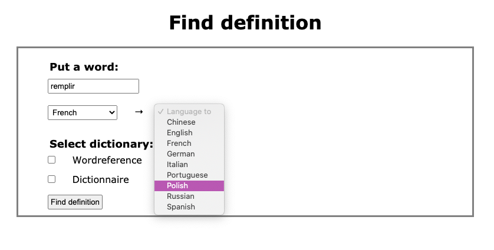
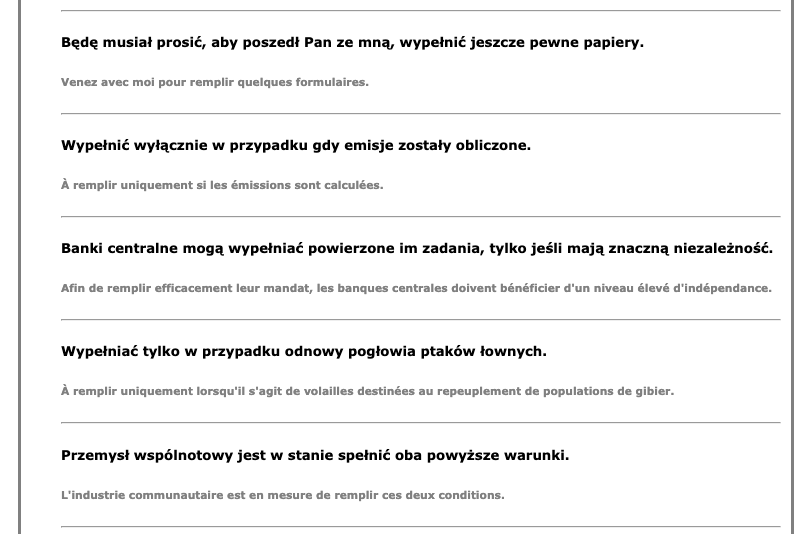

# Dictionary Project

## General info
This app allows you to gather definitions and sentence examples from 2 online dictionaries: https://www.wordreference.com and https://dictionary.reverso.net. Your results are automatically saved in local files in format .xdxf. That allows you to use the app offline in the future.

## Table of contents
* [Screenshots](#screenshots)
* [Setup](#setup)
* [Usage](#usage)
* [Owner](#owner)
* [License](#license)

## Screenshots

### Word translation:

### Sentence examples:


## Setup
### Clone the source:

```shell
$ git clone https://github.com/milenakowalska/dict_project
$ cd dict_project
```
### Install packages

```shell
$ pip install requirements.txt
$ brew install fvcproductions
```
### Run and open the app

Run the code in terminal:

```shell
$ python flask_dictionary_app.py
```

Open the app in browser using http://localhost:5000/

## Usage
Put a word in the text field and select the languages combination and dictionary.
On the top you'll find translations and definitions and below, if available, sentence examples. 
The results will be automatically saved in the .XDXF file with the name: 
{dictionary_name}_{language_from}_{language_to}.xdxf
All dictionary files are placed in the folder named "dictionaries".

## Owner
Created by milenakowalska.

## License
[](http://badges.mit-license.org)

- **[MIT license](http://opensource.org/licenses/mit-license.php)**